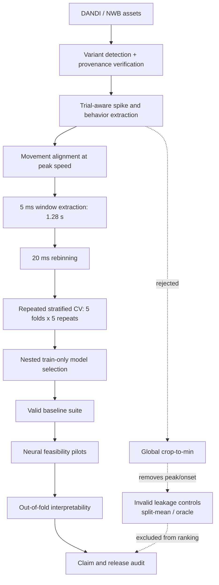

# LatentBrain: Leakage-Safe Neural Population Dynamics and Motor-Behavior Decoding

A reproducible NeuroAI research framework for trial-aware neural data processing, held-out-neuron prediction, latent-dynamics evaluation, and out-of-fold motor-behavior decoding on NLB MC_Maze recordings.


[](https://github.com/sundar139/Latent-Brain/actions/workflows/quality.yml)

> **TL;DR:** Under a frozen, leakage-safe protocol, nested-selected factor latents (`factor_latent_train_selected`) were the strongest valid MC_Maze Large model at **0.1355 mean unified bits/spike** (95% CI 0.1257–0.1461), and their out-of-fold latents decoded ten motor variables at **mean R² ≈ 0.463** with **endpoint-direction balanced accuracy ≈ 0.627**. Results are local cross-validation, associative and predictive — not causal claims and not official NLB leaderboard scores.

---

## Overview

**Research question.** Can leakage-safe, low-dimensional representations of single-trial motor-cortex spiking predict held-out neural activity while preserving behaviorally meaningful movement structure?

Single-trial motor-cortical spiking is noisy, sparse, and variable from trial to trial, and reaching trials have variable durations. The co-smoothing task asks a model to observe one set of neurons (held-in) and predict a disjoint set (held-out) it never sees as input. Getting a trustworthy answer is hard for reasons that are as much about evaluation as modeling: careless trial cropping and split handling leak information, movement events sit at different times in each trial, and unfair model selection inflates any headline number. Without discipline on all of these, a "good" score can reflect leakage rather than neural structure.

**Approach.** LatentBrain extracts trials directly from NWB assets, aligns each trial at peak movement speed, takes a fixed `1.28 s` window at `5 ms`, and rebins to `20 ms`. Models are compared with repeated stratified cross-validation (5 folds × 5 repeats) in which folds and held-in/held-out neuron masks are fixed within a repeat and reused identically across methods. Every fitted quantity — smoothing, standardization, ridge, factor analysis, and the mean-rate reference — is estimated on outer-training trials only, with nested train-only hyperparameter selection and repeat-level paired inference. Latents are then interpreted strictly out-of-fold.

**At a glance:**
- 🔬 Out-of-fold factor latents predict hand/cursor kinematics and encode reach direction, with information beyond a scalar population-rate signal.
- ⚙️ Config-driven, Pydantic-validated pipeline with provenance-hashed datasets, deterministic seeding, and a release audit gating every reportable claim.
- 📊 Repeated stratified CV with fixed neuron masks, nested train-only selection, bootstrap CIs, invalid-control separation, and permutation/shuffle baselines.

---

## Main Findings

| # | Finding | Evidence |
|---|---------|----------|
| 1 | `factor_latent_train_selected` is the strongest valid MC_Maze Large model at **0.1355 mean unified bits/spike** (95% CI 0.1257–0.1461, positive on 25/25 folds). | [Research report](docs/latentbrain_research_report.md), [Results](#results) |
| 2 | Global crop-to-min was rejected: it excludes **≈32.37%** of raw spikes and **≈30.99%** of raw bins and removes the peak-speed event from **≈40%** of trials, so windows were rebuilt from trial-aware data. | [Methodology](#why-global-crop-to-min-was-rejected), [Research report](docs/latentbrain_research_report.md) |
| 3 | The LFADS-style and deterministic neural-ODE feasibility pilots were stable but missed predeclared replacement gates; both branches were retired and neural-model search was closed. | [Neural Feasibility Studies](#neural-feasibility-studies), [Claim registry](docs/latentbrain_claim_registry.md) |
| 4 | Out-of-fold Large factor latents decode ten continuous motor variables at **mean R² ≈ 0.463**, up to R² ≈ 0.652 for `hand_pos_x`. | [Latent Interpretability](#latent-interpretability-and-behavioral-validity), [Research report](docs/latentbrain_research_report.md) |
| 5 | Endpoint direction decodes at **balanced accuracy ≈ 0.627** (chance 0.125), clearly above across-trial permutation (≈0.133, empirical p ≈ 1/101). | [Shuffle Controls](#shuffle-controls), [Latent Interpretability](#latent-interpretability-and-behavioral-validity) |

---

## Architecture



**Life of an experiment.** One reaching trial is read from a verified NWB asset, extracted at `5 ms` in its native length, and aligned so its peak-speed bin sits at the window center. A `1.28 s` window is cut and rebinned to `20 ms`. The trial is assigned to an outer fold; within its repeat, a fixed neuron mask splits held-in from held-out. Held-in spikes feed the model, which predicts held-out rates scored in unified bits/spike against a train-only mean-rate reference. The same trial's out-of-fold factor latents later feed ridge and logistic decoders whose behavioral predictions are compared against permutation and circular-shift controls. Invalid controls (split-mean, oracle) are computed alongside but never enter model ranking.

---

## Tech Stack

| Layer | Tool | Why |
|-------|------|-----|
| Programming | Python 3.11 | `src/` layout, strict typing, mature scientific ecosystem |
| Deep learning | PyTorch | LFADS-style GRU and continuous-time neural pilots with CUDA/AMP |
| Statistical ML | scikit-learn `FactorAnalysis`, Ridge, LogisticRegression | Linear latent baseline and out-of-fold behavior/direction decoders |
| Scientific computing | NumPy, SciPy | Tensors, bootstrap CIs, permutation statistics, Procrustes alignment |
| Data handling | Pandas | Fold/method score tables and machine-readable CSV summaries |
| Neural data formats | NWB, `nlb-tools`, h5py | Authoritative trialization of MC_Maze recordings |
| Data provenance | DANDI metadata + SHA-256 dataset hashes | Variant identity and content verification without redistributing raw data |
| Model evaluation | Custom co-smoothing harness | Unified bits/spike, nested selection, fixed masks reused across methods |
| Statistical inference | SciPy bootstrap + permutation controls | Repeat-level paired CIs and shuffle baselines |
| Visualization | Matplotlib | Diagnostic figures for windows, folds, latents, and controls |
| Configuration | PyYAML + Pydantic (`extra="forbid"`) | Every run is a validated config; unknown keys are a hard error |
| Testing | pytest | CPU-safe unit and script tests requiring no raw data or internet |
| Static analysis | Ruff, mypy (strict) | Lint, format, and full type coverage of the package |
| CI/CD | GitHub Actions | Quality gate on every push and pull request |
| GPU acceleration | CUDA + automatic mixed precision | Fail-fast neural pilots that never silently fall back to CPU |

---

## Quickstart

### Prerequisites

- Windows 11 with PowerShell 7+ (development platform)
- Python 3.11+
- Git
- A CUDA-compatible NVIDIA GPU for the neural pilots (they fail fast without CUDA)
- CPU alone is sufficient for preprocessing, baselines, audits, interpretability replays, and tests

### Installation

```powershell
git clone https://github.com/sundar139/Latent-Brain.git
cd Latent-Brain

python -m venv .venv
.\.venv\Scripts\Activate.ps1

python -m pip install --upgrade pip
pip install -e ".[dev]"          # add ,neurodata for real NWB ingestion
```

### Validate the environment

```powershell
python -m latentbrain.cli validate-config
python scripts/check_environment.py
```

### Run a lightweight verification

```powershell
pytest -q
```

Unit tests require no raw data, no internet, and no CUDA.

### Reproduce research workflows

Raw DANDI assets and all generated results are intentionally not committed. See the [reproducibility guide](docs/latentbrain_reproducibility.md) for DANDI assets, dataset hashes, CPU/GPU requirements, and the full workflow sequence.

---

## Project Structure

```text
Latent-Brain/
├── configs/                  # Frozen YAML experiment and audit protocols
├── data/                     # Ignored raw and processed neural datasets
├── docs/                     # Research report, methodology, claims, reproducibility
├── results/                  # Ignored generated metrics, figures, and checkpoints
├── scripts/                  # Reproducible command-line research workflows
├── src/latentbrain/
│   ├── data/                 # NWB ingestion, trialization, splits, validation, provenance
│   ├── eval/                 # Metrics, CV, leakage audits, interpretation, release audit
│   ├── models/               # Factor-latent, LFADS-style, and continuous-time models
│   ├── train/                # Deterministic training and checkpoint orchestration
│   ├── torch/                # Device resolution, datasets, losses, schedules, checkpoints
│   └── analysis/             # Data-quality reports and figures
├── tests/                    # CPU-safe unit and script tests
├── pyproject.toml
└── README.md
```

---

## Datasets and Provenance

| Dataset | DANDI ID | Version | Trials | Neurons | Behavior channels | Processed hash |
|---------|----------|---------|--------|---------|-------------------|----------------|
| MC_Maze Small | `000140` | `0.220113.0408` | 100 | 142 | 4 | `7ed048df…65fb6d9f` |
| MC_Maze Large | `000138` | `0.220113.0407` | 500 | 162 | 4 | `074f6d69…36830c84` |

MC_Maze Small processes to `[100, 2051, 142]` spikes with four behavior channels (`hand_pos_x/y`, `cursor_pos_x/y`). MC_Maze Large has a global processed shape of `[500, 2006, 162]`, but trial-aware source lengths range from `2006` to `4141` bins; its final leakage-safe evaluation tensor is `[500, 64, 162]` at `20 ms` with 122 held-in and 40 held-out neurons.

- Raw NWB assets are **never** redistributed or downloaded automatically.
- Asset identity and content hashes are verified against DANDI metadata before use.
- Processed `.npz` files are gitignored; scripts abort on any `dataset_hash` mismatch.
- Variant identity (Small vs Large) is read from authoritative NWB metadata, not assumed.
- Behavior and spike provenance are recorded per dataset in [`docs/real_data.md`](docs/real_data.md).

Full processed hashes: `7ed048df5fab3cb8e7c82957c24619a29154800364231467af2deaba65fb6d9f` (Small), `074f6d693ba59b23c7e3449633d7c66171c9b52b22379047b414067036830c84` (Large).

---

## Leakage-Safe Evaluation

### Methodology

- Trials are extracted from the trial-aware raw representation, never a globally cropped tensor.
- Each trial is centered on its peak-speed bin and cut to a `1.28 s` movement window.
- Extraction happens at `5 ms`, then rebins to `20 ms`.
- Comparison uses 5 folds × 5 repeats (25 outer evaluations).
- The held-out neuron mask is fixed within a repeat, and the exact folds and masks are reused across every method.
- Hyperparameters are selected by nested search on outer-training folds only.
- Uncertainty is repeat-level paired, not treated as independent folds.
- Confidence intervals come from hierarchical bootstrap resampling.
- Latent interpretation is strictly out-of-fold.

### Why global crop-to-min was rejected

A single global crop to the shortest trial length discards information and destroys movement alignment on MC_Maze Large:

- **≈32.37%** of raw spikes excluded (`fraction_raw_spikes_excluded = 0.3237`).
- **≈30.99%** of raw bins excluded (`fraction_raw_bins_excluded = 0.3099`).
- The peak-speed event survives in only **60%** of trials, i.e. it is removed from **≈40%** of trials (`fraction_trials_peak_inside_global_crop = 0.6`).

Because event-centered windows cannot be built from a tensor that has already deleted the events, all reported windows are taken from the trial-aware representation.

### Metric definitions

- **Unified bits/spike** — improvement in Poisson log-likelihood over a reference model, normalized to bits per spike; `0` means no improvement over the reference.
- **Poisson NLL** — negative Poisson log-likelihood of predicted rates against held-out spike counts.
- **Positive-fold fraction** — fraction of the 25 outer folds scoring above the reference.
- **Balanced accuracy** — mean per-class recall for direction decoding (chance = 0.125 for 8 directions).
- **R²** — out-of-fold coefficient of determination for continuous behavior decoding.
- **Empirical permutation p-value** — `(#controls ≥ observed + 1) / (permutations + 1)`; with 100 permutations, resolution is ≈`1/101`.

The reference model is the **train-heldout per-neuron mean rate**, fit on outer-training trials only — every unified bits/spike value is scored against it. The invalid split-mean control reads target statistics from the evaluation split and is therefore **non-reportable as model performance**; it is computed only as a leakage diagnostic and excluded from all ranking.

---

## Results

### MC_Maze Small

| Metric | Value |
|--------|-------|
| Valid factor-latent mean | **0.07708** |
| 95% CI | [0.07144, 0.08252] |
| Positive-fold fraction | 1.0 |
| Invalid split-mean control (diagnostic) | 0.07110 |
| Factor − invalid | 0.00598 |
| Reporting status | Reportable under repeated CV only |

Single-split results on Small are **non-reportable**; only the repeated stratified CV protocol yields a reportable factor-latent estimate.

### MC_Maze Large baseline suite

| Method | Mean bits/spike | 95% CI | Positive fraction | Status |
|--------|-----------------|--------|-------------------|--------|
| **`factor_latent_train_selected`** | **0.13554** | **[0.12574, 0.14609]** | **1.0** | **Valid — best reported** |
| `factor_latent_fixed` | 0.12272 | [0.11324, 0.13279] | 1.0 | Valid |
| `smoothed_cosmoothing_ridge` | 0.12156 | [0.11185, 0.13179] | 1.0 | Valid |
| `reduced_rank_cosmoothing` | 0.08790 | [0.07895, 0.09703] | 1.0 | Valid |
| `train_mean_rate` | 0.00000 | — | — | Reference (not a model) |
| `split_mean_rate_invalid` | 0.00897 | [0.00799, 0.01006] | 1.0 | Invalid control (diagnostic only) |

`factor_latent_train_selected` replaced the fixed baseline because it cleared every predeclared replacement gate: nested train-only model selection, a repeat-level paired comparison against the incumbent (paired difference **+0.01283**, 95% CI [0.01120, 0.01424], positive on all 25 repeats), and reproduction of the fixed baseline to zero difference.

### Why these numbers are credible

1. **Train-mean reference at 0.0** — every reported score is a genuine improvement over an honest, train-only reference.
2. **Invalid leakage control near zero** (0.00897) — the split-mean control barely beats the reference, so the valid factor-latent gain is not a leakage artifact.
3. **Confidence intervals** — hierarchical bootstrap CIs sit well above the reference for all valid methods.
4. **Positive-fold consistency** — all valid methods are positive on 25/25 folds.
5. **Repeated neuron-mask evaluation** — masks and folds are fixed within a repeat and reused across methods, so comparisons are paired.
6. **Reproduction checks** — the release audit re-scores accepted baselines and confirms metric and claim consistency.

Small and Large score magnitudes are **not** compared as direct model improvement; the cross-dataset comparison is protocol-stability only.

---

## Neural Feasibility Studies

Both neural pilots ran on a single held-out-neuron mask (repeat 0), 5 folds × 5 seeds (25 completed runs, 0 failures), with checkpoints selected on inner validation. Neither is a final five-repeat model result.

### LFADS pilot

| Property | Value |
|----------|-------|
| Mean unified bits/spike | 0.02926 |
| Paired difference vs baseline | −0.14467 |
| Completed runs | 25/25 |
| Positive run / seed fraction | 1.0 / 1.0 |
| Seed-level std | 0.00102 |
| Factor effective rank | 1.22 / 32 (fraction 0.038) |
| Full-evaluation recommended | No |
| Status | **Retired** |

The LFADS-style pilot was seed-stable but sat far below the factor-latent baseline, showed a near-peak reconstruction failure, and badly underutilized its factor subspace (effective rank ≈1.2 of 32). It did not clear the gate for multi-repeat evaluation.

### Deterministic neural-ODE pilot

Same repeat, folds, masks, and seeds; Euler integration with diffusion disabled and zero solver failures.

| Property | Value |
|----------|-------|
| Mean unified bits/spike | 0.14129 |
| Paired difference vs baseline | −0.03263 |
| Near-peak failure | Absent |
| Before / near / after peak bits/spike | 0.15698 / 0.14317 / 0.12547 |
| Factor effective rank | 3.56 / 32 (fraction 0.111) |
| Runs beating baseline | 0 / 25 |
| Targeted diagnostic | negative-neuron concentration (20% of neurons) |
| Status | **Retired** |

The deterministic neural-ODE pilot attenuated the LFADS near-peak failure and used a broader factor spectrum (effective rank ≈3.6 vs ≈1.2), but still trailed the baseline on every run, and a targeted diagnostic traced the remaining gap to negative-neuron concentration with no single available repair. It was retired and the neural-model search was closed.

| Descriptive comparison (same repeat) | LFADS pilot | Neural-ODE pilot |
|---|---|---|
| Mean unified bits/spike | 0.02926 | 0.14129 |
| Paired difference vs baseline | −0.14467 | −0.03263 |
| Factor effective rank (of 32) | 1.22 | 3.56 |
| Near-peak failure | present | absent |
| Runs beating baseline | 0 / 25 | 0 / 25 |

This is a same-repeat descriptive comparison. Neither pilot is a final five-repeat model result, the frozen factor-latent baseline remains the strongest valid Large model, and these experiments do **not** show universal superiority of statistical models over neural dynamical models.

---

## Latent Interpretability and Behavioral Validity

Out-of-fold Large factor latents (`[100, 64, 16]` per fold) were decoded across all 25 folds.

| Target | Mean out-of-fold R² | 95% CI |
|--------|---------------------|--------|
| `hand_pos_x` | 0.65228 | [0.62592, 0.67825] |
| `hand_pos_y` | 0.48194 | [0.45957, 0.50432] |
| `hand_vel_x` | 0.58925 | [0.56519, 0.61240] |
| `hand_vel_y` | 0.41688 | [0.40561, 0.42814] |
| `hand_speed` | 0.19855 | [0.18117, 0.21613] |
| `cursor_pos_x` | 0.64488 | [0.61944, 0.67040] |
| `cursor_pos_y` | 0.47061 | [0.44816, 0.49306] |
| `cursor_vel_x` | 0.57140 | [0.54667, 0.59390] |
| `cursor_vel_y` | 0.39566 | [0.38602, 0.40522] |
| `cursor_speed` | 0.20927 | [0.19061, 0.22794] |

Mean continuous R² across all ten targets is **0.463**.

**Endpoint direction decoding:**

| Metric | Value |
|--------|-------|
| Accuracy | 0.78400 |
| Balanced accuracy | 0.62658 |
| Macro F1 | 0.59009 |
| Chance | 0.12500 |
| Permutation p | ≈ 1/101 |

**Latent geometry.**
- Effective latent dimension ≈ **13.22 / 16**.
- Mean direction-separability ratio ≈ **0.607**.
- Temporal trajectory progression is coherent across the window.
- Relational trajectory geometry (fold stability ≈0.74, mask stability ≈0.83) is more stable than exact subspace orientation.
- Latents carry predictive structure **beyond** a scalar population-rate signal (beyond-rate ≈0.463).

---

## Shuffle Controls

| Control | Observed | Control mean | Empirical p |
|---------|----------|--------------|-------------|
| Across-trial continuous permutation | 0.46364 | 0.00008 | ≈ 1/101 |
| Within-trial circular shift (continuous) | 0.46364 | 0.34115 | ≈ 1/101 |
| Across-trial direction permutation | 0.62572 | 0.13286 | ≈ 1/101 |
| Direction-label permutation | 0.62572 | 0.13331 | ≈ 1/101 |

The across-trial control collapses to near zero, confirming that continuous decoding depends on trial-specific latent structure. The within-trial circular-shift control remains substantially above zero (≈0.341), so temporal smoothness and autocorrelation explain part of the continuous decoding signal — but the observed R² (≈0.464) stays clearly above the shifted control. With 100 permutations, empirical p-value resolution is limited to ≈`1/101`; no finer precision is implied.

---

## Reproducing the Work

Representative sequence (see the [complete reproducibility guide](docs/latentbrain_reproducibility.md) for the full protocol, seed policy, and data placement):

**CPU-capable workflows**

```powershell
python -m latentbrain.cli validate-config
python scripts/check_environment.py

python scripts/run_window_audit.py `
  --config configs/mc_maze_large_window_audit.yaml

python scripts/run_recommended_window_cv.py `
  --config configs/mc_maze_large_recommended_window_cv.yaml

python scripts/run_baseline_suite.py `
  --config configs/mc_maze_large_baseline_suite.yaml

python scripts/run_latent_interpretability.py `
  --config configs/mc_maze_large_latent_interpretability.yaml

python scripts/run_release_audit.py `
  --config configs/latentbrain_release.yaml
```

**GPU-only workflows (require CUDA)**

```powershell
python scripts/run_lfads_pilot.py `
  --config configs/mc_maze_large_lfads_pilot.yaml

python scripts/run_neural_ode_pilot.py `
  --config configs/mc_maze_large_neural_ode_pilot.yaml
```

Notes:
- Seeds are set via `randomness.seed_everything`; `configs/base.yaml` sets `deterministic: true`.
- Every experiment is config-driven with Pydantic validation.
- Dataset and checkpoint hashes are verified; scripts abort on mismatch.
- All generated outputs (`data/`, `results/`, `reports/`, checkpoints, latents, figures) are gitignored.
- Neural pilots require CUDA and fail fast otherwise; unit tests require no raw data, internet, or CUDA.
- Runtime varies substantially by hardware and is not asserted here.

---

## Research Reports

| Report | Question it answers |
|--------|---------------------|
| [Final research report](docs/latentbrain_research_report.md) | What are the final, protocol-frozen findings and their boundaries? |
| [Claim registry](docs/latentbrain_claim_registry.md) | Which claims are supported, descriptive-only, or unsupported? |
| [Reproducibility guide](docs/latentbrain_reproducibility.md) | How is each workflow reproduced, with what data, hardware, and hashes? |
| [Release notes](docs/latentbrain_release_notes.md) | What is in this release and what protocol produced it? |
| [Real-data record](docs/real_data.md) | How were MC_Maze assets acquired, verified, and trialized? |
| [Research methodology](docs/research_methodology.md) | Why are the evaluation, selection, and control choices designed this way? |

---

## Limitations & Claim Safety

### Scope
- Two MC_Maze dataset variants from one subject/session family (Jenkins).
- A motor-cortex delayed-reaching task only.
- No cross-species or cross-task validation.
- No official NLB leaderboard submission.

### Method
- `FactorAnalysis` is a linear latent model.
- Behavior is temporally smooth, and the circular-shift control stays above zero, so autocorrelation explains part of continuous decoding.
- Latent axes are rotationally non-identifiable.
- Neural-model conclusions apply to the tested configurations and predeclared gates, on one neuron mask rather than all five repeats.

### What these results do not show
- ❌ State-of-the-art or official leaderboard performance
- ❌ A causal relationship between inferred latents and movement
- ❌ Recovery of the true biological neural manifold
- ❌ Universal superiority of factor models over neural dynamical models
- ❌ Direct performance improvement from Small to Large
- ❌ Generalization to other subjects, brain areas, species, or tasks

Findings are associative and predictive. Distance modulation of trajectory magnitude remains descriptive only, and permutation-test resolution is ≈`1/101`.

---

## Development Checks

| Check | Command | Status |
|-------|---------|--------|
| Unit + script tests | `pytest -q` | 965 passed |
| Lint | `ruff check .` | clean |
| Format | `ruff format --check .` | clean |
| Type checking | `mypy src` | clean (strict) |
| Config validation | `python -m latentbrain.cli validate-config` | passing |
| Environment check | `python scripts/check_environment.py` | passing |
| Release audit | `python scripts/run_release_audit.py --config configs/latentbrain_release.yaml` | `ready: true` |
| CI | GitHub Actions Quality | passing |

Type checking uses `mypy==2.2.0` in strict mode. The release audit reports `ready: true` with no blockers. Generated outputs, data, latents, and checkpoints are not committed.

---

## Dataset Citation

Raw NWB files are not redistributed in this repository; users must retrieve data from DANDI, and usage remains subject to each source dataset's terms.

**Datasets (verified from repository provenance records):**

- MC_Maze Small — DANDI `000140`, version `0.220113.0408`.
  <https://gui.dandiarchive.org/#/dandiset/000140>
- MC_Maze Large — DANDI `000138`, version `0.220113.0407`, DOI `10.48324/dandi.000138/0.220113.0407`.
  <https://gui.dandiarchive.org/#/dandiset/000138>

Both datasets are part of the **Neural Latents Benchmark (NLB)** MC_Maze task family. Data are stored in the **Neurodata Without Borders (NWB)** format and accessed through the **DANDI Archive**.

---

## Author

**Rohith Sundar Jonnalagadda**<br>
MS Computer Science, Kennesaw State University

[GitHub](https://github.com/sundar139)

## License

MIT — see [LICENSE](LICENSE).
